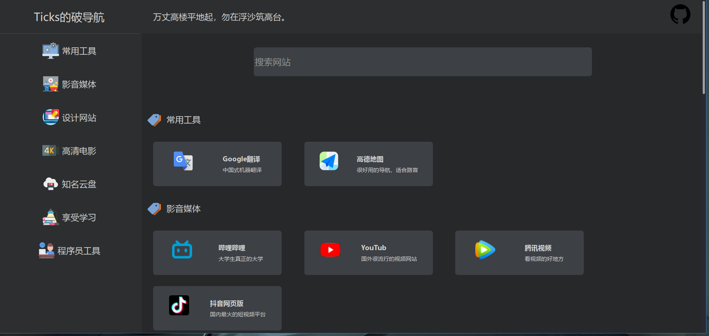

### 一个简单的网站导航
选修课期末要求做一个自己想做的网页，
要求只能使用html，js和css，就做一个简单导航算了。

像这种网页导航用到的数据和样式都比较有规律，所以先写好样式，
然后通过js动态加载节点，对于网站的数据源，如果原先就写好不方便后期添加和修改，
采用json来加载数据源，方便后期添加和修改。

- **data** : 里面有一个文件 `config.json`，这个json文件存放数据源
- **css** : 存放样式文件
- **img** : 存放网站导航的图片，如果图片有错误样式显示就会有问题
- **js** : js文件夹，存放javascript脚本
- index.html : 主页
- search.html : 展示搜索结果

json文件数据源格式比较简单:
```json
{
    "logoText": "Ticks的破导航(这里可以写上左上角的logo字样)", 
    "oneWord": "这里是上方的一言", 
    "data": [
        {
            "category": "常用工具(分类名称)", 
            "image": "img/xxx.png(img下的分类图片，显示在左边)", 
            "id": "category_id(分类id,主要用于点击左边可以跳转到指定区域)", 
            "content": [
                {
                    "name": "Google翻译(具体分类下的项目)", 
                    "image": "google_translate.png(同上)", 
                    "description": "中国式机器翻译(网站简要描述)", 
                    "url": "https://translate.google.cn/(网站地址，点击会跳转到这里)"
                }, 
                {
                    "name": "高德地图", 
                    "image": "gd_map.png", 
                    "description": "很好用的导航，适合路盲", 
                    "url": "https://www.amap.com/"
                }
            ]
        }
    ]
}
```

### 截图


### 注意
json文件格式一定要正确，里面图片名称也要正确，不然界面都会出现错误。

